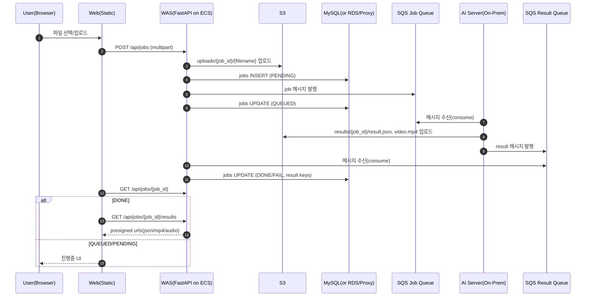

# 🎵 Beat (Phase 2) — WAS ↔ S3 ↔ DB ↔ SQS ↔ AI 비동기 파이프라인

> **사용자 업로드 음악을 AI로 분석**하고, **분석 결과(JSON/MP4)** 를 기반으로 웹 화면이 반응하도록 만드는  
> **하이브리드(AWS + 온프레) 비동기 처리 아키텍처**입니다.

<p align="center">
  
</p>

<p align="center">
  
  
  
  
</p>

---

## 목차

- [1. 프로젝트 한 줄 요약](#1-프로젝트-한-줄-요약)
- [2. 전체 흐름](#2-전체-흐름)
- [3. 구성요소](#3-구성요소)
- [4. API 스펙](#4-api-스펙)
- [5. SQS 메시지 계약](#5-sqs-메시지-계약)
- [6. DB 스키마](#6-db-스키마)
- [7. 환경 변수](#7-환경-변수)
- [8. 로컬 실행](#8-로컬-실행)
- [9. 배포 메모](#9-배포-메모)
- [10. 트러블슈팅](#10-트러블슈팅)
- [11. 다음 개선 과제](#11-다음-개선-과제)
- [Appendix. 리포지토리 구조(예시)](#appendix-리포지토리-구조예시)

---

## 1. 프로젝트 한 줄 요약

- **Web**(정적 페이지)에서 음악 업로드
- **WAS(FastAPI, ECS)** 가 **S3 업로드 + DB jobs 생성 + SQS Job 발행**
- **AI(온프레)** 가 **SQS Job 소비 → 분석 → S3 결과 업로드 → SQS Result 발행**
- **WAS Result Consumer** 가 **SQS Result 소비 → DB jobs 업데이트(DONE/FAIL)**
- **Web**은 `/api/jobs/{id}` & `/api/jobs/{id}/results` 로 **상태/결과 URL(프리사인)** 을 받아 화면을 갱신

---

## 2. 전체 흐름


---

## 3. 구성요소

| 구분 | 컴포넌트 | 역할 |
|---|---|---|
| Front | Web (Static) | 업로드 / 폴링 / 결과 반영(UI) |
| Backend | WAS (FastAPI) | 업로드 수신, S3 저장, DB 기록, SQS 발행, 결과 URL 제공 |
| Queue | SQS Job / Result + DLQ | 비동기 처리(분석 요청/결과 전달), 실패 메시지 분리 |
| Storage | S3 | 원본 업로드 + 결과 산출물(JSON/MP4/HTML 등) 보관 |
| DB | `jobs` 테이블 | 작업 상태/결과 키 저장(멱등 업데이트) |
| AI | 온프레 AI 서버 | Job consume → 분석 → 결과 업로드 → Result publish |
| Network | VPC Peering + DB Proxy(EC2+HAProxy) | VPC 분리 환경에서 DB 연결 우회(TCP 프록시) |
| Observability | Datadog | ALB/ECS/Task 모니터링 |

> ✅ **현재 구현**은 WAS 내부에 **Result Consumer(Thread)** 를 띄워 **Result Queue를 소비**합니다.  
> (마감용 빠른 완성 버전 / 추후 Worker 서비스로 분리 예정)

---

## 4. API 스펙

### 4.1 Health

**`GET /api/health`**

```json
{ "ok": true }
```
### 4.2 Job 생성 (업로드)

**`POST /api/jobs`** *(multipart/form-data)*

**필드**
- `file` *(필수)*: mp3/wav 등
- `version` *(선택, 기본 3)*: AI 계약 버전(1/2/3)
- `user_request` *(선택, 기본 "")*: 사용자 프롬프트/옵션

**응답 예시**
```json
{
  "job_id": "6377193a-b99d-4a09-8a81-d6f89088c833",
  "status": "QUEUED",
  "upload_s3_key": "uploads/6377193a-b99d-4a09-8a81-d6f89088c833/song.mp3"
}
```
