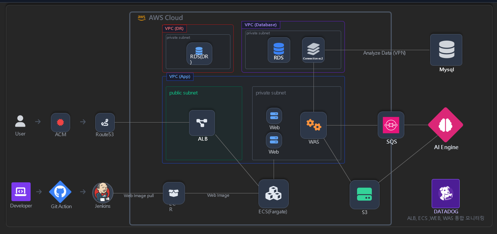
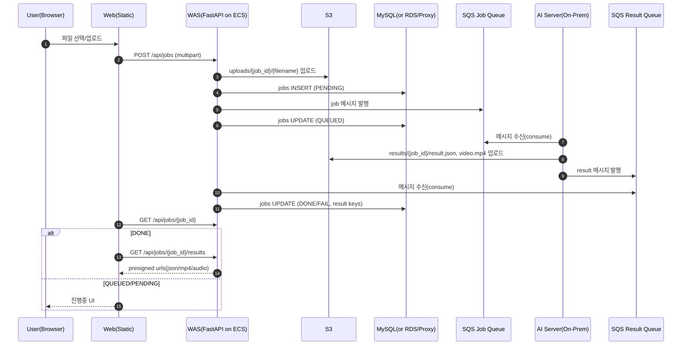

# 🎵 Beat (Phase 2) — WAS ↔ S3 ↔ DB ↔ SQS ↔ AI 비동기 파이프라인

> **사용자 업로드 음악을 AI로 분석**하고, **분석 결과(JSON/MP4)** 를 기반으로 웹 화면이 반응하도록 만드는  
> **하이브리드(AWS + 온프레) 비동기 처리 아키텍처**입니다.

<p align="center">
  
</p>

<p align="center">
  
  
  
  
</p>

---

## 목차

- [1. 프로젝트 한 줄 요약](#1-프로젝트-한-줄-요약)
- [2. 전체 흐름](#2-전체-흐름)
- [3. 구성요소](#3-구성요소)
- [4. API 스펙](#4-api-스펙)
- [5. SQS 메시지 계약](#5-sqs-메시지-계약)
- [6. DB 스키마](#6-db-스키마)
- [7. 환경 변수](#7-환경-변수)
- [8. 로컬 실행](#8-로컬-실행)
- [9. 배포 메모](#9-배포-메모)
- [10. 트러블슈팅](#10-트러블슈팅)
- [11. 다음 개선 과제](#11-다음-개선-과제)
- [Appendix. 리포지토리 구조(예시)](#appendix-리포지토리-구조예시)

---

## 1. 프로젝트 한 줄 요약

- **Web**(정적 페이지)에서 음악 업로드
- **WAS(FastAPI, ECS)** 가 **S3 업로드 + DB jobs 생성 + SQS Job 발행**
- **AI(온프레)** 가 **SQS Job 소비 → 분석 → S3 결과 업로드 → SQS Result 발행**
- **WAS Result Consumer** 가 **SQS Result 소비 → DB jobs 업데이트(DONE/FAIL)**
- **Web**은 `/api/jobs/{id}` & `/api/jobs/{id}/results` 로 **상태/결과 URL(프리사인)** 을 받아 화면을 갱신

---

## 2. 전체 흐름


---

## 3. 구성요소

| 구분 | 컴포넌트 | 역할 |
|---|---|---|
| Front | Web (Static) | 업로드 / 폴링 / 결과 반영(UI) |
| Backend | WAS (FastAPI) | 업로드 수신, S3 저장, DB 기록, SQS 발행, 결과 URL 제공 |
| Queue | SQS Job / Result + DLQ | 비동기 처리(분석 요청/결과 전달), 실패 메시지 분리 |
| Storage | S3 | 원본 업로드 + 결과 산출물(JSON/MP4/HTML 등) 보관 |
| DB | `jobs` 테이블 | 작업 상태/결과 키 저장(멱등 업데이트) |
| AI | 온프레 AI 서버 | Job consume → 분석 → 결과 업로드 → Result publish |
| Network | VPC Peering + DB Proxy(EC2+HAProxy) | VPC 분리 환경에서 DB 연결 우회(TCP 프록시) |
| Observability | Datadog | ALB/ECS/Task 모니터링 |

> ✅ **현재 구현**은 WAS 내부에 **Result Consumer(Thread)** 를 띄워 **Result Queue를 소비**합니다.  
> (마감용 빠른 완성 버전 / 추후 Worker 서비스로 분리 예정)

---

## 4. API 스펙

### 4.1 Health

**`GET /api/health`**

```json
{ "ok": true }
```
### 4.2 Job 생성 (업로드)

**`POST /api/jobs`** *(multipart/form-data)*

**필드**
- `file` *(필수)*: mp3/wav 등
- `version` *(선택, 기본 3)*: AI 계약 버전(1/2/3)
- `user_request` *(선택, 기본 "")*: 사용자 프롬프트/옵션

**응답 예시**
```json
{
  "job_id": "6377193a-b99d-4a09-8a81-d6f89088c833",
  "status": "QUEUED",
  "upload_s3_key": "uploads/6377193a-b99d-4a09-8a81-d6f89088c833/song.mp3"
}
```
### 4.3 Job 상태 조회

**`GET /api/jobs/{job_id}`**

작업의 현재 상태와 S3 키(업로드/결과)를 조회합니다.

**Path Parameter**
- `job_id` *(string, required)*: 작업 ID(UUID)

**Response (200 OK)**
- `job_id` *(string)*: 작업 ID
- `status` *(string)*: `PENDING | QUEUED | RUNNING | DONE | FAIL`
- `upload_s3_key` *(string)*: 업로드된 원본 오디오 S3 Key
- `original_name` *(string|null)*: 원본 파일명
- `result_json_key` *(string|null)*: 결과 JSON S3 Key
- `result_html_key` *(string|null)*: 결과 HTML S3 Key
- `result_mp4_key` *(string|null)*: 결과 MP4 S3 Key
- `error` *(string|null)*: 오류 메시지(실패 시)

**Response 예시**
~~~json
{
  "job_id": "6377193a-b99d-4a09-8a81-d6f89088c833",
  "status": "DONE",
  "upload_s3_key": "uploads/6377193a-b99d-4a09-8a81-d6f89088c833/song.mp3",
  "original_name": "song.mp3",
  "result_json_key": "results/6377193a-b99d-4a09-8a81-d6f89088c833/result.json",
  "result_html_key": null,
  "result_mp4_key": "results/6377193a-b99d-4a09-8a81-d6f89088c833/video.mp4",
  "error": null
}
~~~

**Errors**
- `404 Not Found`: `job_id`가 존재하지 않음
~~~json
{ "detail": "job not found" }
~~~

---

### 4.4 결과 URL 조회 (DONE일 때만)

**`GET /api/jobs/{job_id}/results`**

DONE 상태의 작업에 대해 결과 파일 접근을 위한 **Presigned URL**을 제공합니다.

**Path Parameter**
- `job_id` *(string, required)*: 작업 ID(UUID)

**조건**
- `status == DONE` 인 경우에만 성공
- `status != DONE` 이면 **409 Conflict**

**Response (200 OK)**
- `job_id` *(string)*: 작업 ID
- `status` *(string)*: `DONE`
- `urls.json` *(string|null)*: 결과 JSON Presigned URL
- `urls.mp4` *(string|null)*: 결과 MP4 Presigned URL
- `urls.audio` *(string|null)*: 원본 오디오 Presigned URL *(선택 제공)*

**Response 예시**
~~~json
{
  "job_id": "6377193a-b99d-4a09-8a81-d6f89088c833",
  "status": "DONE",
  "urls": {
    "json": "https://.../result.json?X-Amz-Signature=...",
    "mp4": "https://.../video.mp4?X-Amz-Signature=...",
    "audio": "https://.../song.mp3?X-Amz-Signature=..."
  }
}
~~~

**Errors**
- `409 Conflict`: 아직 DONE이 아님
~~~json
{ "detail": "job is not DONE" }
~~~
- `404 Not Found`: `job_id`가 존재하지 않음
~~~json
{ "detail": "job not found" }
~~~

---

## 5. SQS 메시지 계약

> 큐는 **Standard SQS** 기준이며, 중복 메시지 가능성이 있어 소비자는 **멱등 처리**를 전제로 합니다.

### 5.1 Job Queue (WAS → AI)

WAS가 업로드를 끝낸 뒤 AI에게 분석을 요청할 때 보내는 메시지입니다.

**Payload**
- `task_id` *(string)*: 작업 ID (= `job_id`)
- `s3_audio_key` *(string)*: 업로드된 오디오 S3 Key
- `version` *(number)*: 계약 버전
- `user_request` *(string)*: 사용자 옵션/프롬프트

**예시**
~~~json
{
  "task_id": "6377193a-b99d-4a09-8a81-d6f89088c833",
  "s3_audio_key": "uploads/6377193a-b99d-4a09-8a81-d6f89088c833/song.mp3",
  "version": 3,
  "user_request": "default"
}
~~~

---

### 5.2 Result Queue (AI → WAS)

AI가 분석을 완료한 뒤 WAS에게 결과를 전달할 때 보내는 메시지입니다.

**Payload**
- `task_id` *(string)*: 작업 ID (= `job_id`)
- `status` *(string)*: `DONE | FAIL`
- `result.json_key` *(string|null)*: 결과 JSON S3 Key
- `result.html_key` *(string|null)*: 결과 HTML S3 Key
- `result.mp4_key` *(string|null)*: 결과 MP4 S3 Key
- `version` *(number)*: 계약 버전
- `error` *(string|null)*: 실패 사유(FAIL일 때)

**예시**
~~~json
{
  "task_id": "6377193a-b99d-4a09-8a81-d6f89088c833",
  "status": "DONE",
  "result": {
    "json_key": "results/6377193a-b99d-4a09-8a81-d6f89088c833/result.json",
    "html_key": null,
    "mp4_key": "results/6377193a-b99d-4a09-8a81-d6f89088c833/video.mp4"
  },
  "version": 3,
  "error": null
}
~~~

> 🔎 참고: **SNS → SQS** 형태로 감싸져 오는 경우가 있어  
> 수신 시 `{"Message":"...json..."}` 구조도 **방어적으로 파싱**합니다.

---

## 6. DB 스키마

현재 DB는 **`jobs` 테이블만 사용**합니다.

### 6.1 jobs 테이블 (권장 DDL 예시)

~~~sql
CREATE TABLE jobs (
  job_id          VARCHAR(36)  NOT NULL PRIMARY KEY,
  upload_s3_key   TEXT         NOT NULL,
  original_name   TEXT         NULL,
  status          VARCHAR(16)  NOT NULL,

  result_json_key TEXT         NULL,
  result_html_key TEXT         NULL,
  result_mp4_key  TEXT         NULL,
  error_message   TEXT         NULL,

  created_at      TIMESTAMP    NOT NULL DEFAULT CURRENT_TIMESTAMP,
  updated_at      TIMESTAMP    NOT NULL DEFAULT CURRENT_TIMESTAMP ON UPDATE CURRENT_TIMESTAMP
);

CREATE INDEX idx_jobs_status ON jobs(status);
~~~

### 6.2 상태값

- `PENDING` → DB row 생성 직후  
- `QUEUED` → SQS job 발행 완료  
- `DONE` → 결과 처리 완료(키 저장)  
- `FAIL` → 실패(에러 메시지 기록)

> ✅ SQS(Standard)는 **중복 메시지**가 올 수 있어  
> **멱등 업데이트(이미 DONE이면 덮어쓰기 방지)** 를 적용했습니다.

---

## 7. 환경 변수

> ECS Task 환경변수(또는 `.env`)로 주입합니다.  
> ⚠️ **절대 secrets(tfvars, .env)를 Git에 커밋하지 마세요.** `.env.example`만 올리기!

### 7.1 AWS / S3

| 변수 | 필수 | 기본값 | 설명 |
|---|:---:|---|---|
| `AWS_REGION` |  | `ap-northeast-2` | 리전 |
| `S3_BUCKET` | ✅ | - | 업로드/결과 버킷 |
| `S3_UPLOAD_PREFIX` |  | `uploads` | 업로드 prefix |
| `S3_RESULT_PREFIX` |  | `results` | 결과 prefix |
| `PRESIGN_EXPIRE_SECONDS` |  | `3600` | 프리사인 URL 만료(초) |

### 7.2 SQS

| 변수 | 필수 | 설명 |
|---|:---:|---|
| `JOB_QUEUE_URL` | ✅ | 분석 요청 큐 URL |
| `RESULT_QUEUE_URL` | ✅ | 분석 결과 큐 URL |

### 7.3 DB

| 변수 | 필수 | 기본값 | 설명 |
|---|:---:|---|---|
| `DB_HOST` | ✅ | - | DB Host(or Proxy) |
| `DB_PORT` |  | `3306` | DB Port |
| `DB_USER` | ✅ | - | DB User |
| `DB_PASS` | ✅ | - | DB Password |
| `DB_NAME` | ✅ | - | DB Name |
| `DB_CHARSET` |  | `utf8mb4` | Charset |

### 7.4 (선택) Callback 테스트용

| 변수 | 필수 | 기본값 | 설명 |
|---|:---:|---|---|
| `CALLBACK_TOKEN` |  | `change-me` | 테스트/콜백 검증용 토큰 |

---

## 8. 로컬 실행

로컬에서 전체 파이프라인을 완전히 재현하려면 **AWS 리소스(S3/SQS)** 와 **DB** 가 필요합니다.

~~~bash
python -m venv .venv
source .venv/bin/activate

pip install -r requirements.txt

cp .env.example .env
# .env에 JOB/RESULT_QUEUE_URL, DB_* 등 설정

uvicorn app.main:app --host 0.0.0.0 --port 8080
~~~

**Response (200 OK)**
- `job_id` *(string)*: 작업 ID
- `status` *(string)*: `PENDING | QUEUED | RUNNING | DONE | FAIL`
- `upload_s3_key` *(string)*: 업로드된 원본 오디오 S3 Key
- `original_name` *(string|null)*: 원본 파일명
- `result_json_key` *(string|null)*: 결과 JSON S3 Key
- `result_html_key` *(string|null)*: 결과 HTML S3 Key
- `result_mp4_key` *(string|null)*: 결과 MP4 S3 Key
- `error` *(string|null)*: 오류 메시지(실패 시)

**Response 예시**
~~~json
{
  "job_id": "6377193a-b99d-4a09-8a81-d6f89088c833",
  "status": "DONE",
  "upload_s3_key": "uploads/6377193a-b99d-4a09-8a81-d6f89088c833/song.mp3",
  "original_name": "song.mp3",
  "result_json_key": "results/6377193a-b99d-4a09-8a81-d6f89088c833/result.json",
  "result_html_key": null,
  "result_mp4_key": "results/6377193a-b99d-4a09-8a81-d6f89088c833/video.mp4",
  "error": null
}
~~~

**Errors**
- `404 Not Found`: `job_id`가 존재하지 않음
~~~json
{ "detail": "job not found" }
~~~

---

### 4.4 결과 URL 조회 (DONE일 때만)

**`GET /api/jobs/{job_id}/results`**

DONE 상태의 작업에 대해 결과 파일 접근을 위한 **Presigned URL**을 제공합니다.

**Path Parameter**
- `job_id` *(string, required)*: 작업 ID(UUID)

**조건**
- `status == DONE` 인 경우에만 성공
- `status != DONE` 이면 **409 Conflict**

**Response (200 OK)**
- `job_id` *(string)*: 작업 ID
- `status` *(string)*: `DONE`
- `urls.json` *(string|null)*: 결과 JSON Presigned URL
- `urls.mp4` *(string|null)*: 결과 MP4 Presigned URL
- `urls.audio` *(string|null)*: 원본 오디오 Presigned URL *(선택 제공)*

**Response 예시**
~~~json
{
  "job_id": "6377193a-b99d-4a09-8a81-d6f89088c833",
  "status": "DONE",
  "urls": {
    "json": "https://.../result.json?X-Amz-Signature=...",
    "mp4": "https://.../video.mp4?X-Amz-Signature=...",
    "audio": "https://.../song.mp3?X-Amz-Signature=..."
  }
}
~~~

**Errors**
- `409 Conflict`: 아직 DONE이 아님
~~~json
{ "detail": "job is not DONE" }
~~~
- `404 Not Found`: `job_id`가 존재하지 않음
~~~json
{ "detail": "job not found" }
~~~

---

## 5. SQS 메시지 계약

> 큐는 **Standard SQS** 기준이며, 중복 메시지 가능성이 있어 소비자는 **멱등 처리**를 전제로 합니다.

### 5.1 Job Queue (WAS → AI)

WAS가 업로드를 끝낸 뒤 AI에게 분석을 요청할 때 보내는 메시지입니다.

**Payload**
- `task_id` *(string)*: 작업 ID (= `job_id`)
- `s3_audio_key` *(string)*: 업로드된 오디오 S3 Key
- `version` *(number)*: 계약 버전
- `user_request` *(string)*: 사용자 옵션/프롬프트

**예시**
~~~json
{
  "task_id": "6377193a-b99d-4a09-8a81-d6f89088c833",
  "s3_audio_key": "uploads/6377193a-b99d-4a09-8a81-d6f89088c833/song.mp3",
  "version": 3,
  "user_request": "default"
}
~~~

---

### 5.2 Result Queue (AI → WAS)

AI가 분석을 완료한 뒤 WAS에게 결과를 전달할 때 보내는 메시지입니다.

**Payload**
- `task_id` *(string)*: 작업 ID (= `job_id`)
- `status` *(string)*: `DONE | FAIL`
- `result.json_key` *(string|null)*: 결과 JSON S3 Key
- `result.html_key` *(string|null)*: 결과 HTML S3 Key
- `result.mp4_key` *(string|null)*: 결과 MP4 S3 Key
- `version` *(number)*: 계약 버전
- `error` *(string|null)*: 실패 사유(FAIL일 때)

**예시**
~~~json
{
  "task_id": "6377193a-b99d-4a09-8a81-d6f89088c833",
  "status": "DONE",
  "result": {
    "json_key": "results/6377193a-b99d-4a09-8a81-d6f89088c833/result.json",
    "html_key": null,
    "mp4_key": "results/6377193a-b99d-4a09-8a81-d6f89088c833/video.mp4"
  },
  "version": 3,
  "error": null
}
~~~

> 🔎 참고: **SNS → SQS** 형태로 감싸져 오는 경우가 있어  
> 수신 시 `{"Message":"...json..."}` 구조도 **방어적으로 파싱**합니다.

---

## 6. DB 스키마

현재 DB는 **`jobs` 테이블만 사용**합니다.

### 6.1 jobs 테이블 (권장 DDL 예시)

~~~sql
CREATE TABLE jobs (
  job_id          VARCHAR(36)  NOT NULL PRIMARY KEY,
  upload_s3_key   TEXT         NOT NULL,
  original_name   TEXT         NULL,
  status          VARCHAR(16)  NOT NULL,

  result_json_key TEXT         NULL,
  result_html_key TEXT         NULL,
  result_mp4_key  TEXT         NULL,
  error_message   TEXT         NULL,

  created_at      TIMESTAMP    NOT NULL DEFAULT CURRENT_TIMESTAMP,
  updated_at      TIMESTAMP    NOT NULL DEFAULT CURRENT_TIMESTAMP ON UPDATE CURRENT_TIMESTAMP
);

CREATE INDEX idx_jobs_status ON jobs(status);
~~~

### 6.2 상태값

- `PENDING` → DB row 생성 직후  
- `QUEUED` → SQS job 발행 완료  
- `DONE` → 결과 처리 완료(키 저장)  
- `FAIL` → 실패(에러 메시지 기록)

> ✅ SQS(Standard)는 **중복 메시지**가 올 수 있어  
> **멱등 업데이트(이미 DONE이면 덮어쓰기 방지)** 를 적용했습니다.

---

## 7. 환경 변수

> ECS Task 환경변수(또는 `.env`)로 주입합니다.  
> ⚠️ **절대 secrets(tfvars, .env)를 Git에 커밋하지 마세요.** `.env.example`만 올리기!

### 7.1 AWS / S3

| 변수 | 필수 | 기본값 | 설명 |
|---|:---:|---|---|
| `AWS_REGION` |  | `ap-northeast-2` | 리전 |
| `S3_BUCKET` | ✅ | - | 업로드/결과 버킷 |
| `S3_UPLOAD_PREFIX` |  | `uploads` | 업로드 prefix |
| `S3_RESULT_PREFIX` |  | `results` | 결과 prefix |
| `PRESIGN_EXPIRE_SECONDS` |  | `3600` | 프리사인 URL 만료(초) |

### 7.2 SQS

| 변수 | 필수 | 설명 |
|---|:---:|---|
| `JOB_QUEUE_URL` | ✅ | 분석 요청 큐 URL |
| `RESULT_QUEUE_URL` | ✅ | 분석 결과 큐 URL |

### 7.3 DB

| 변수 | 필수 | 기본값 | 설명 |
|---|:---:|---|---|
| `DB_HOST` | ✅ | - | DB Host(or Proxy) |
| `DB_PORT` |  | `3306` | DB Port |
| `DB_USER` | ✅ | - | DB User |
| `DB_PASS` | ✅ | - | DB Password |
| `DB_NAME` | ✅ | - | DB Name |
| `DB_CHARSET` |  | `utf8mb4` | Charset |

### 7.4 (선택) Callback 테스트용

| 변수 | 필수 | 기본값 | 설명 |
|---|:---:|---|---|
| `CALLBACK_TOKEN` |  | `change-me` | 테스트/콜백 검증용 토큰 |

---

## 8. 로컬 실행

로컬에서 전체 파이프라인을 완전히 재현하려면 **AWS 리소스(S3/SQS)** 와 **DB** 가 필요합니다.

~~~bash
python -m venv .venv
source .venv/bin/activate

pip install -r requirements.txt

cp .env.example .env
# .env에 JOB/RESULT_QUEUE_URL, DB_* 등 설정

uvicorn app.main:app --host 0.0.0.0 --port 8080
~~~

### 8.1 빠른 테스트(curl)

~~~bash
# 업로드
curl -X POST "http://localhost:8080/api/jobs" \
  -F "file=@./song.mp3" \
  -F "version=3" \
  -F "user_request="

# 상태 조회
curl "http://localhost:8080/api/jobs/<job_id>"

# DONE이면 결과 URL
curl "http://localhost:8080/api/jobs/<job_id>/results"
~~~

---

## 9. 배포 메모

### 9.1 ECS(Fargate)
- WAS는 **ECS Task**로 배포
- startup에서 **Result Consumer(thread)** 가 실행되어 **Result Queue**를 소비

### 9.2 IAM 권한 체크리스트
Task Role(또는 Execution Role)에 아래 권한 필요:

- S3: `PutObject`, `GetObject`
- SQS:
  - Job Queue: `SendMessage`
  - Result Queue: `ReceiveMessage`, `DeleteMessage`, `GetQueueAttributes`

### 9.3 네트워크(하이브리드 / DB Proxy)
- VPC 분리/라우팅 때문에 DB 직접 연결이 어려워 **DR VPC의 EC2를 DB Proxy**로 사용
- EC2에서 HAProxy **TCP 프록시**
  - `0.0.0.0:3308` listen → 실제 DB `:3306`

---

## 10. 트러블슈팅

<details>
<summary><b>① HAProxy가 기동 실패</b></summary>

- `frontend default_backend` ↔ `backend` 이름 불일치 → 즉시 실패
- 포트 충돌(예: 3307 사용 중) → **3308로 변경**

~~~bash
sudo haproxy -c -f /etc/haproxy/haproxy.cfg
sudo systemctl status haproxy
sudo ss -lntp | grep 3308
~~~
</details>

<details>
<summary><b>② WAS → DB 연결 500 / timeout</b></summary>

- VPC/라우팅/SG 문제 가능
- Task Definition env가 반영 안 되면 **새 revision + Force new deployment**
</details>

<details>
<summary><b>③ MySQL 인증 플러그인 오류(cryptography)</b></summary>

- `sha256_password` / `caching_sha2_password` 사용 시 `cryptography` 필요
- `requirements.txt` 추가 후 이미지 재빌드/재배포
</details>

<details>
<summary><b>④ SQS AccessDenied</b></summary>

- Task Role 정책에 SQS 권한 누락 (특히 ResultQueue `Receive/Delete`)
</details>

<details>
<summary><b>⑤ Web이 DONE 이후에도 화면 변경 안 됨</b></summary>

- 응답 스키마 불일치(키 이름/중첩 구조) 원인이 많음
- 권장 흐름: `DONE → /results 호출 → urls(mp4/json/audio) 사용`
</details>

<details>
<summary><b>⑥ DB host blocked(1129)</b></summary>

~~~bash
mysqladmin -u root -p flush-hosts
~~~

- 연결 폭주/재시도 줄이기(consumer 재시도, `desired_count` 조정)
</details>
